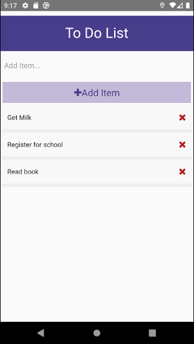

# To-Do-List_App

This mobile application uses React Native and can be deployed to Android and IOS devices.
This app acts as a to-do list that allows users to input tasks and items and display them in a list format.

